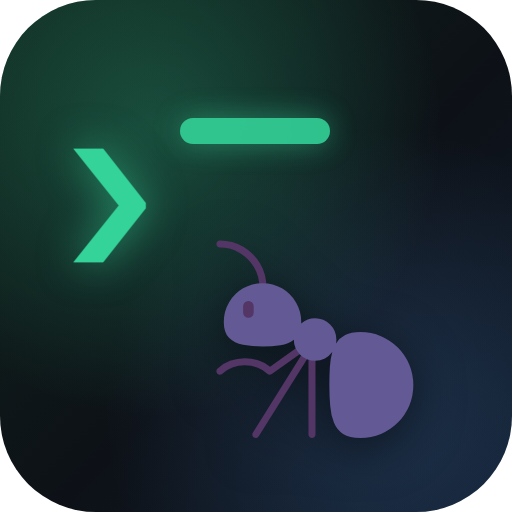

# Termite

**A terminal client that doesn’t assume you only have one server.**

SSH sessions in tabs and split panes, SFTP, port forwarding, and a host vault
with agent, key and bastion support. Run a step across forty machines and watch
the exit codes come back. Wire up an LLM with your own API key, or leave it off.

Electron and xterm.js, on macOS and Windows. MIT licensed. No account, no
telemetry, no server in the middle.

[Website](https://justynroberts.github.io/termite/) ·
[Releases](../../releases) ·
[Issues](../../issues)

## Install

Builds are attached to each [release](../../releases). There is no package
manager yet.

| Platform | File | Notes |
|---|---|---|
| macOS | `Termite-<ver>-mac.dmg` | Universal — Apple Silicon and Intel. Signed with a Developer ID and notarised, so it opens without a Gatekeeper prompt. |
| Windows | `Termite-Setup-<ver>.exe` | x64, per-user install. Unsigned, so SmartScreen asks once: *More info → Run anyway*. |
| Windows | `Termite-Portable-<ver>.exe` | No install. Copy it anywhere and run. |

## Features

**Terminal**
- Tabbed SSH terminals (xterm.js on the WebGL renderer, 256-color), Ctrl+Tab to switch,
  middle-click to close
- Powerline prompts and Nerd Font icons work without configuration — the core Powerline
  glyphs (``…) are drawn by the renderer itself in any font, and the official
  Symbols Nerd Font is bundled for the extended icon set (git branch, web, folders, …);
  a system-installed Nerd Font is used first when present
- **Split panes** — up to 8 per tab in columns and rows, each pane its own live SSH session.
  Split with the tab-strip buttons or shortcuts; close a pane with its hover ✕, `Ctrl+Shift+W`,
  or just `exit` the shell (split panes auto-collapse when their shell exits)
- Focused pane gets an accent indicator; snippets and the AI copilot always target it
- **Zen mode** (`Ctrl+Shift+Z`): fullscreen with every bit of chrome hidden — just your
  terminals edge to edge. Exit with the same shortcut or the faint ✕ pill top-right
- Clipboard: `Ctrl+C` copies when text is selected and sends SIGINT when it is not,
  `Ctrl+V`/`Ctrl+Shift+V` paste, `Ctrl+Shift+C` copies, right-click copies selection or
  pastes, optional copy-on-select (PuTTY style), and visible Copy/Paste pane actions
- **Authentication handoff assistant** detects OAuth/device-login links (including wrapped Claude
  CLI links), opens the complete URL in your browser, then pastes and submits the returned code
- **Duplicate session** opens an independent connection to the same host; synchronized input can
  broadcast typing across every pane in a split tab (with a conspicuous red armed state)
- Multi-line paste confirmation protects remote shells from accidental bulk execution
- Open SSH tabs and split layouts are restored after restart with fresh connections
- Per-host environment variables and startup commands automate login setup
- Search terminal scrollback with `Ctrl/Cmd+F` or the pane toolbar
- Per-app font, cursor, and scrollback settings applied live

**Keyboard shortcuts**

| Action | Shortcut |
|---|---|
| AI Copilot | `Ctrl/Cmd + K` |
| Zen mode (fullscreen, chrome hidden) | `Ctrl/Cmd + Shift + Z` |
| Split pane right | `Ctrl/Cmd + Shift + E` |
| Split pane down | `Ctrl/Cmd + Shift + O` |
| Close pane | `Ctrl/Cmd + Shift + W` |
| Duplicate session | `Ctrl/Cmd + Shift + D` |
| Find in terminal | `Ctrl/Cmd + F` |
| Close tab | `Ctrl/Cmd + W` |
| Next / previous tab | `Ctrl + Tab` / `Ctrl + Shift + Tab` |

**Hosts & auth**
- Host vault with groups, tags, colors, and search — double-click to connect,
  **right-click to edit**, or use the always-visible row buttons (terminal / SFTP / edit / delete)
- Password, SSH key, and SSH agent auth (Windows OpenSSH agent + `SSH_AUTH_SOCK`)
- Jump host (bastion) chaining
- Import hosts from `~/.ssh/config`
- Known-host fingerprint pinning (TOFU) with loud mismatch warnings
- Secrets encrypted at rest with the OS keychain (DPAPI / macOS Keychain) via Electron `safeStorage`

**Keys**
- Generate ed25519 (OpenSSH format) or RSA-4096 keys in-app
- One-click copy of the public key for `authorized_keys`
- Import existing private key files

**Files (SFTP)**
- Dual-pane local ⇄ remote browser
- Upload/download files **and whole directories** with live progress
- mkdir, delete (recursive), rename, path bar, multi-select (Ctrl+click)

**Tunnels**
- Local, remote, and dynamic (SOCKS5) port forwarding with start/stop control

**LLM (Ctrl+K)** — optional, and it uses your own Anthropic API key
- Describe what you want, get a command back with Run / Insert / Copy. Nothing executes until you click
- "Explain last error" is given the recent scrollback of the focused pane, so it explains the error you actually hit
- Explain output, summarise a session, or plain sysadmin chat
- Destructive commands come back with guardrails attached

**Snippets**
- Save frequent commands, run them in the focused pane with one click

**Fleet management — runbooks**
- Multi-step, multi-host command orchestration: patch a fleet, roll a deploy, run health
  checks — each step targets one or more hosts, in parallel or rolling one-at-a-time
- Fail-fast or continue-on-error per step, optional timeouts, per-step interpreter
  (login shell / bash / PowerShell for Windows hosts)
- Live run view: step timeline, per-host status + exit codes, streaming collapsible
  output, cancel mid-run
- Drafting: describe the job and the LLM writes the steps (pre-checks, change,
  verification) for you to review and target before anything runs

**Appearance**
- Windows 11: Mica / Acrylic window materials, rounded corners, native
  window-controls overlay; macOS vibrancy. Switchable (or fully solid) in Settings → Appearance
- Theme-aware custom title bar
- 10 terminal themes (Dracula, Nord, Tokyo Night, Catppuccin, Gruvbox, One Dark, Monokai,
  Solarized dark/light, Termite Dark) with a live visual picker
- Bundled coding fonts: JetBrains Mono, Fira Code (ligatures), IBM Plex Mono, Source Code Pro;
  Inter for the UI — all packaged, no network needed
- Dark and light app themes

## Updates

Termite checks GitHub Releases in the background — shortly after launch, every
couple of hours, and when the window regains focus. It skips the check while a
runbook or a file transfer is in flight, and it never restarts without asking:
the restart drops every live SSH session, so the dialog says how many are open
first. Off switch and a manual check are in **Settings → Updates**.

| Build | Behaviour |
|---|---|
| macOS `.dmg` | Downloads in the background, then offers to restart and install |
| Windows `Termite-Setup-*.exe` | Downloads in the background, then offers to restart and install |
| Windows `Termite-Portable-*.exe` | Reports the new version and opens the download — there is no installer to update through |

The portable build is detected before the download rather than after it, so it
never pulls 190 MB it cannot use.

macOS self-updates require a Developer ID signature: Squirrel.Mac will not let an
app replace itself unless the new copy's signature satisfies the running one's
designated requirement, and an ad-hoc signature has no identity to satisfy it
with. `src/main/updater.ts` reads the running bundle's signature at startup and
falls back to notify-and-download when it is not signed — so an unsigned local
build behaves sensibly without any configuration.

Updater activity is written to `updater.log` in the app's log folder
(`~/Library/Logs/Termite`, or `%APPDATA%\Termite\logs`).

## Development

```bash
npm install
npm run dev        # hot-reload dev mode
npm run build      # production build to out/
npm run typecheck
```

## Packaging & deployment

One command per platform — output lands in `dist/`:

```bash
npm run package:win   # → Termite-Setup-<ver>.exe (installer) + Termite-Portable-<ver>.exe
npm run package:mac   # → Termite-<ver>-mac.dmg + .zip (universal: Apple Silicon + Intel)
```

The portable `.exe` needs no installation at all — copy it anywhere and run.

### CI releases (recommended)

Push the repo to GitHub, then cut a release with:

```bash
git tag v0.1.0
git push origin main --tags
```

The included [GitHub Actions workflow](.github/workflows/release.yml) builds **Windows and macOS
installers in parallel** and attaches them to a GitHub Release automatically. No signing
certificates needed to get started (see below). You can also trigger a build manually from the
Actions tab (`workflow_dispatch`) — artifacts appear on the run page.

### Code signing

macOS releases are signed and notarised locally:

```bash
npm run package:mac:signed
```

This needs a Developer ID Application certificate in the login keychain and
notarytool credentials stored once:

```bash
xcrun notarytool store-credentials "notarytool" --apple-id <id> --team-id <team>
```

It signs the app, notarises and staples it, then signs, notarises and staples the
disk image separately — the dmg carries its own ticket and inherits nothing from
the app. Stapling rewrites the dmg after electron-builder has hashed it, so
`scripts/refresh-update-metadata.js` regenerates `latest-mac.yml` from the
finished bytes; publishing the original hash would fail verification on every
update.

Two things not to "fix": `CSC_NAME` holds the **bare** identity name, because
electron-builder rejects the `Developer ID Application:` prefix while `codesign`
requires it (`scripts/sign-dmg.js` adds it back). And the metadata refresh runs
as a build step rather than an electron-builder hook, because the manifest does
not exist yet when the last hook fires.

CI builds are unsigned, and macOS signing stays local by design: the certificate
and the notarytool profile live on one machine, a GitHub runner has neither, and
a tag-triggered workflow would race the local build and publish ad-hoc images
over it. Creating a release creates the tag, which starts that workflow — cancel
the run, or it replaces the signed artifacts.

Windows signing would need `CSC_LINK` / `CSC_KEY_PASSWORD` secrets (PFX cert);
electron-builder picks those up automatically.

### App icon

`build/icon.png` (512×512) is auto-converted to `.ico`/`.icns` per platform.
Regenerate it after design tweaks with `npm run icon`.

## Security notes

- Passwords, private keys, passphrases, and your API key are encrypted with the OS keychain before touching disk (`termite-store.json` in the app's user-data folder).
- The renderer never sees stored secrets — all SSH happens in the main process behind a typed IPC bridge with `contextIsolation` on.
- Host keys are pinned on first use; a changed fingerprint refuses the connection and warns you.
- Your Anthropic API key is only ever sent to the Anthropic API.

## License

MIT — see [LICENSE](LICENSE). Copyright © 2026 Justyn Roberts <justyn@fintonlabs.com>.
